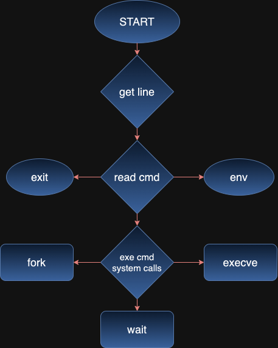

# Simple Shell (Holberton School) 

<details>
  <summary>Table of Contents</summary>
  <ol>
    <li><a href="#simple-shell-holberton-school">About Project</a></li>
    <li><a href="#general-workflow">General Workflow</a></li>
    <li><a href="#installation-and-usage-of-program">Installation and Usage of Program</a></li>
    <li><a href="#testing">Testing</a></li>
    <li><a href="#learning-objectives">Learning Objectives</a></li>
    <li><a href="#files-contained-in-this-repository">Files contained in this repository </a></li>
    <li><a href="#credits">Credits</a></li>
  </ol>
</details>

This project presents a minimalistic shell implementation in C, offering users a fundamental command-line interface to interact with the underlying operating system. In Linux/Unix systems, a shell serves as a crucial interface between the user and the kernel, facilitating the execution of commands and managing processes. In the context of this simple shell, it performs three primary functions: allowing users to gracefully exit the shell, displaying environment variables, and executing generic commands. The implementation leverages system calls like **fork**, **execve**, and **wait** for process management and employs a straightforward approach to building command paths, ensuring a basic yet functional shell experience.


## General Workflow

<div align="right">
<a href="#general-workflow"></a>
</div>

* **Reading the Command**: The shell uses the getline function to read user input and interpret the command.
* **Command Execution**: The shell distinguishes between three functionalities:
* **Exit**: The user can exit the shell by entering the '`exit`' command.
* **Print Environment Variables**: The shell supports printing environment variables using a specific command.
* **Generic Command Execution**: For generic commands, the shell relies on system calls. The key system calls involved are:
    * **fork**: Creates a new process to execute the command.
    * **execve**: Loads and executes the specified command in the new process.
    * **wait**: Parent process waits for the child process to complete.
* **Building the Command Path**: For executing generic commands, the shell builds the command path by obtaining the command from the Unix file system and appending "`/cmd`" to include the custom command.


## Installation and Usage of Program
**Prerequisites**
* C Compiler (e.g., GCC)

**To use the shell, follow these steps:**

* Clone the repository: 
```
git clone https://github.com/Ferlandoo/holbertonschool-simple_shell.git
```
* Navigate to the project directory: 
```
cd simple-shell
```
* Compile the shell program: 
```
gcc -Wall -Werror -Wextra -pedantic -std=gnu89 *.c -o hsh
```
* Run the shell: 
```
./hsh
```

## Testing

Your shell should work like this in interactive mode:
```
$ ./hsh
($) /bin/ls
hsh main.c shell.c
($)
($) exit
$
```
But also in non-interactive mode:
```
$ echo "/bin/ls" | ./hsh
hsh main.c shell.c test_ls_2
$
$ cat test_ls_2
/bin/ls
/bin/ls
$
$ cat test_ls_2 | ./hsh
hsh main.c shell.c test_ls_2
hsh main.c shell.c test_ls_2
$
```

## Learning Objectives

* **Syscalls:** Understanding and implementing system calls for process creation, file I/O, and more.
* **Process:** Managing processes and understanding the parent-child relationship in a Unix-like environment.
* **Environment:** Handling and manipulating the environment variables.
* **Tokenization:** Breaking down input commands into tokens for processing.
* **Shell Execution Flow:** Understanding the flow of a basic shell program from input to command execution.

## Files contained in this repository 

| Name  | Information |
| ------------- | ------------- |
| man_1_simple_shell | 	Man page of the `simple_shell`.  |
| main.h  | Header file with standard libraries and custom prototypes.  |
| command_path.c  | Function that find and return full path of a command.  |
| env-utils.c | Functions that print and gets value of an environment variable. |
| shell.c | Main function and two other functions that read and execute the commands on main.  |
| AUTHORS | Authors of this project. |

## Credits

Shell made by [@Ferlandoo](https://www.github.com/Ferlandoo), [@EderHodaj](https://github.com/EderHodaj) and [@FloriMecaj](https://github.com/FloriMecaj).
